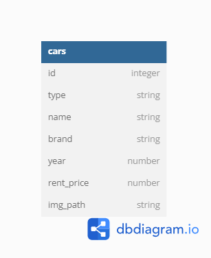
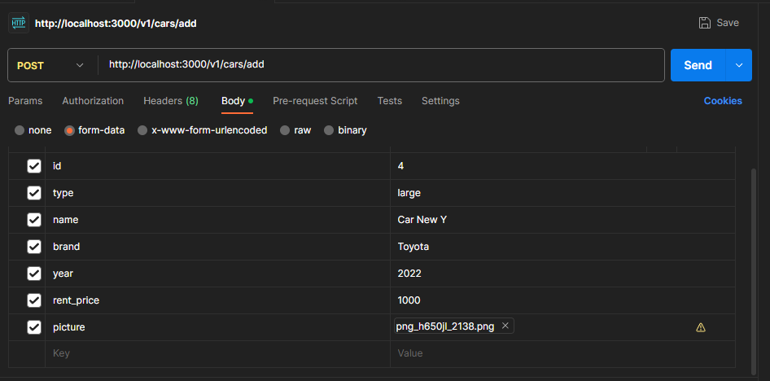
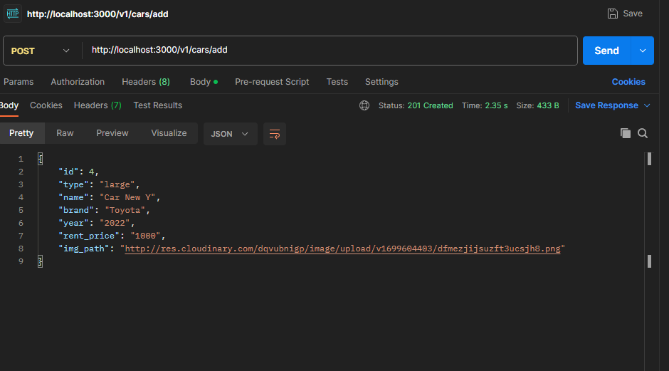
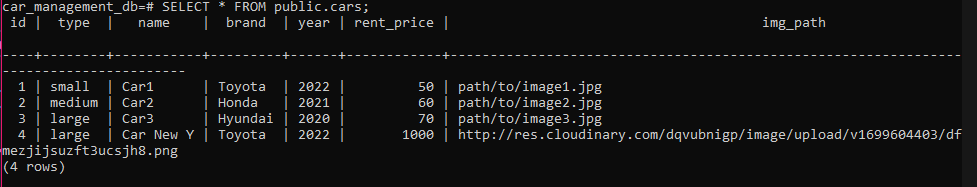

# Car Management Dashboard

Car Management Dashboard is a API for Website.

## ERD

## EndPoint

### API

- [GET] http://localhost:3000/v1/cars => Show list cars data
- [GET] http://localhost:3000/v1/cars?brand=:carBrand => Show list cars data by brand filter.
- [GET] http://localhost:3000/v1/cars/:id => Show car data by ID
- [POST] http://localhost:3000/v1/cars/add => Add new car data
- [PUT] http://localhost:3000/v1/cars/:id => Update car data
- [DELETE] http://localhost:3000/v1/cars/:id Delete car data by ID

### Request Body for add Data

### Response Body for add Data

### Database Preview after add Data

## How to install project

- Download or clone the repository.
- install dependencies in frontend and backend with "npm install".
- configure your postgres user in `knexfile.ts` and `index.ts`.
- configure your cloudinary key in `src/controllers/carsControllers.ts`.
- run `npm run migrate` in terminal this project.
- run `npx knex seed:run` in terminal this project for get seeding data in database.
- run `npm run start` in terminal this project for run project.
- access the endpoint by Postman.
